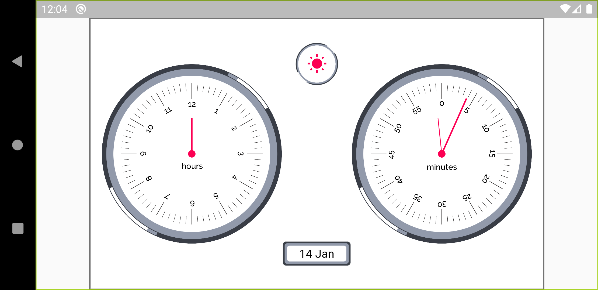
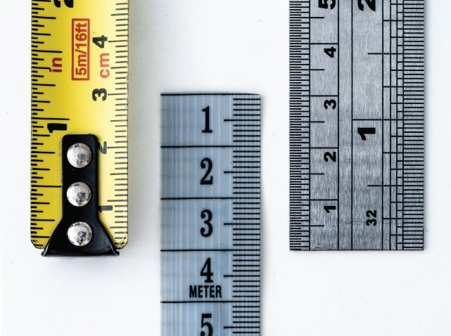

# Perfectionist Analog Clock
By Praharsh Bhatt And Richard Pariath

This app is for an entry for Flutter Clock competition https://flutter.dev/clock

webapp: https://perfectionist-flutter-clock.firebaseapp.com/web/

# The Concept and Story

A watch face for Lenovo Smart Clock, inspired by measuring the instruments of the 20th century.

The watch face inspires us to tell a story of the time in the most precisive and perfect way, while being simple and minimal at the same time, just like the draftsmen before us, highlighting the importance of measuring time and it's significance.

This watch face is designed tobe simple enough to accurately tell the time.
The markings in the watch face are based on measuring instruments.

# The Team
Developed by Praharsh Bhatt
https://praharshbhatt.github.io/Portfolio/

Designs and concepts by Richard Pariath
https://www.behance.net/thedesignchild